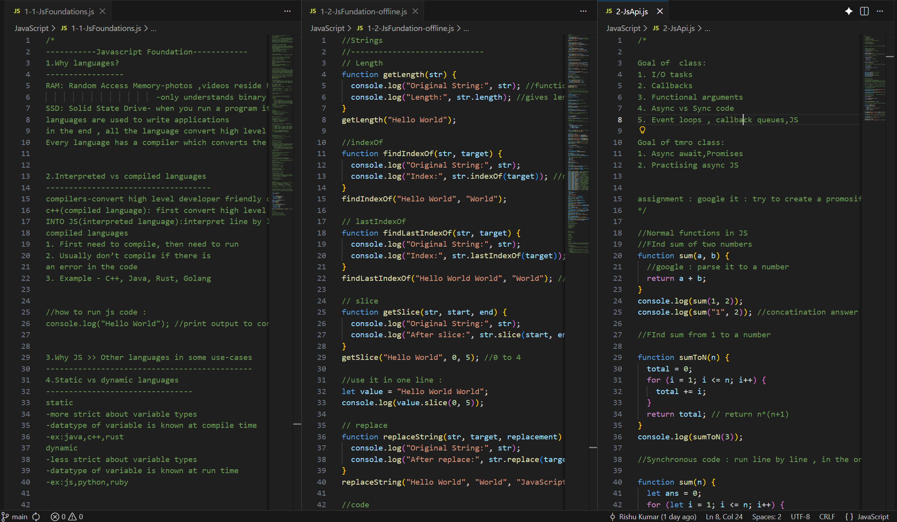
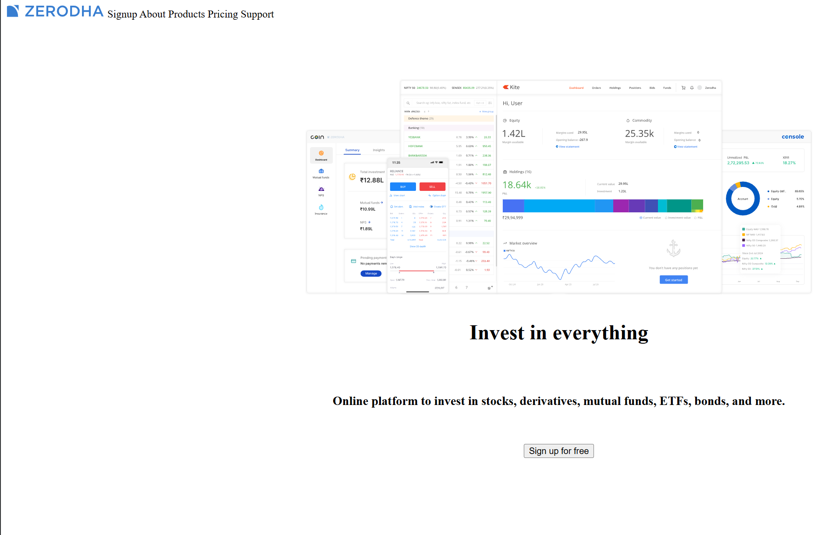
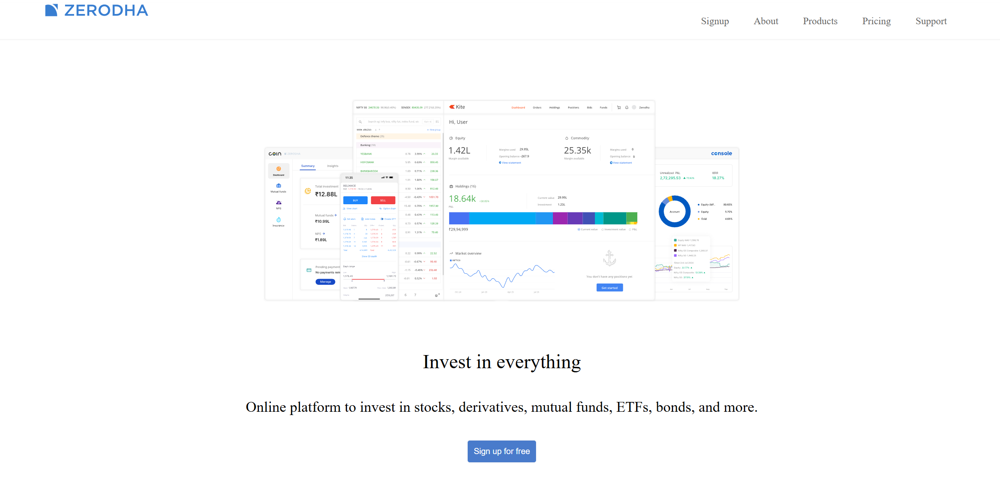
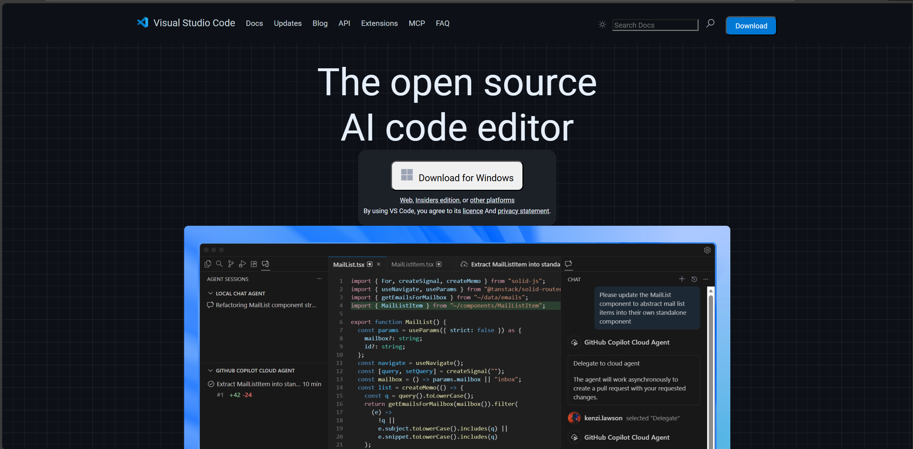

# 🚀 100xDevs Bootcamp Journey
Hey 
Minimalist logs and notes of my full-stack learning journey.

- 🎓 **Course**: [100xSchool Bootcamp](https://harkirat.classx.co.in/new-courses/24)
- 👨‍🏫 **Instructor**: [Harkirat Singh](https://github.com/hkirat) ([Twitter](https://x.com/kirat_tw))

---

## 📂 Directory Index

### 📁 `Web-Dev-Warmup/`

#### 📂 `Html-Css-basics-simple-zerodha-app/`

- 📝 **[HTML CSS Learning Notes](./Web-Dev-Warmup/Html-Css-basics-simple-zerodha-app/html-css-learning-notes.md)**

#### 📂 `Html-and-Css-Vs-code/`

### 📁 `JavaScript/`

- 📝 **[JS Foundations](./JavaScript/1-1-JsFoundations.js)**
- 📝 **[JS Foundation Offline](./JavaScript/1-2-JsFundation-offline.js)**
- 📝 **[JS APIs](./JavaScript/2-JsApi.js)

---

## 🖼️ Evolution: Js Pre Requisite

| Version | Visual Preview                                                  |
| :------ | :-------------------------------------------------------------- |
| **1**   |  |

---

## 🖼️ Evolution: Zerodha Clone

| Version                | Visual Preview                                                                                | Code                                                                            |
| :--------------------- | :-------------------------------------------------------------------------------------------- | :------------------------------------------------------------------------------ |
| **Ugly** (HTML only)   |  | [Source](./Web-Dev-Warmup/Html-Css-basics-simple-zerodha-app/ugly-zerodha.html) |
| **Nice** (CSS Flexbox) |  | [Source](./Web-Dev-Warmup/Html-Css-basics-simple-zerodha-app/nice-zerodha.html) |

## 🖼️ Evolution: VS-Code Landing Page Clone

| Version                 | Visual Preview                                                                          | Code                                                                      |
| :---------------------- | :-------------------------------------------------------------------------------------- | :------------------------------------------------------------------------ |
| **Final** (CSS Flexbox) |  | [Source](./Web-Dev-Warmup/Html-and-Css-Vs-code/vs-code-landing-page.html) |

---

## 🔗 Socials

Tracking my progress daily on X: [**@rishukumark19**](https://x.com/rishukumark19)
